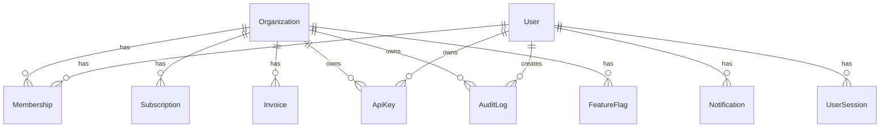

# Architecture

**SaaSForge** follows a layered architecture with a clean separation between HTTP controllers, business logic, and data access. This document describes the architectural decisions, patterns, and conventions used throughout the codebase.

---

## Table of Contents

- [Layered Architecture](#layered-architecture)
- [Application Factory Pattern](#application-factory-pattern)
- [Service Layer](#service-layer)
- [Multi-Tenancy](#multi-tenancy)
- [Caching Strategy](#caching-strategy)
- [Background Jobs](#background-jobs)
- [Error Handling](#error-handling)
- [Request Lifecycle](#request-lifecycle)
- [Key Architectural Decisions](#key-architectural-decisions)

---

## Layered Architecture

```
┌──────────────────────────────────────────────────────────┐
│                    PRESENTATION LAYER                     │
│                                                          │
│   Blueprints (9)         Templates (47)     Static JS    │
│   ┌──────────────┐     ┌──────────────┐  ┌────────────┐ │
│   │ Thin routes  │────→│ Jinja2 +     │  │ main.js    │ │
│   │ (~30-50 loc) │     │ HTMX +       │  │ (client    │ │
│   │ parse, call, │     │ Alpine.js    │  │  logic)    │ │
│   │ render       │     │ TailwindCSS  │  │            │ │
│   └──────┬───────┘     └──────────────┘  └────────────┘ │
│          │                                                │
├──────────┼────────────────────────────────────────────────┤
│          ▼                                                │
│   ┌────────────────────────────────────────────────────┐  │
│   │                 SERVICE LAYER                       │  │
│   │                                                     │  │
│   │  16 service classes:                                │  │
│   │  AuthService          BillingService                │  │
│   │  OrganizationService  AnalyticsService              │  │
│   │  EmailService         AuditService                  │  │
│   │  CacheService         NotificationService           │  │
│   │  SessionService       TwoFactorService              │  │
│   │  ImpersonationService RoleService                   │  │
│   │  EntitlementService   JobScheduler                  │  │
│   │                                                     │  │
│   │  Services raise typed exceptions for controller     │  │
│   │  handling (ValidationError, NotFoundError, etc.)    │  │
│   └────────────────────────────────────────────────────┘  │
│                          │                                 │
├──────────────────────────┼────────────────────────────────┤
│                          ▼                                 │
│   ┌────────────────────────────────────────────────────┐  │
│   │                 DATA LAYER                          │  │
│   │                                                     │  │
│   │  15 SQLAlchemy models      6 Alembic migrations     │  │
│   │  User, Organization,       Initial schema →         │  │
│   │  Membership, Subscription, 2FA fields →             │  │
│   │  Invoice, AuditLog, ...    brand_color ...          │  │
│   └────────────────────────────────────────────────────┘  │
│                          │                                 │
├──────────────────────────┼────────────────────────────────┤
│                          ▼                                 │
│   ┌────────────────────────────────────────────────────┐  │
│   │              INFRASTRUCTURE LAYER                   │  │
│   │                                                     │  │
│   │  PostgreSQL   Redis     Stripe     SendGrid         │  │
│   │  (primary)   (cache +   (billing)  (email)          │  │
│   │               queue)                                │  │
│   └────────────────────────────────────────────────────┘  │
└──────────────────────────────────────────────────────────┘
```

### Layer Responsibilities

**Presentation Layer** (`app/*/routes.py`, `app/templates/`)
- Parse HTTP input (form data, query params, JSON bodies)
- Call the appropriate service method
- Handle service exceptions (flash messages, template rendering, JSON error responses)
- Render Jinja2 templates with HTMX partial updates

**Service Layer** (`app/services/`)
- Encapsulate all business logic
- Perform database operations through SQLAlchemy models
- Coordinate cross-cutting concerns (caching, auditing, notifications, email)
- Raise typed exceptions for the presentation layer to handle

**Data Layer** (`app/core/models.py`, `migrations/`)
- Define database schema through SQLAlchemy ORM models
- Manage schema evolution via Alembic migrations
- Enforce relationships and constraints

**Infrastructure Layer**
- PostgreSQL for persistent storage
- Redis for caching and background job queue
- Stripe for payment processing
- SendGrid for email delivery

---

## Application Factory Pattern

The application is initialized through `create_app()` in `app/__init__.py`, following the Flask application factory pattern.

```python
def create_app(config_class=Config):
    app = Flask(__name__)
    app.config.from_object(config_class)

    initialize_extensions(app)       # db, login, csrf, limiter, cache, swagger
    register_blueprints(app)         # 9 blueprints with URL prefixes
    register_error_handlers(app)     # 400, 403, 404, 429, 500
    register_context_processors(app) # global template variables
    register_template_filters(app)   # humanize filter
    register_shell_context(app)      # db, models for flask shell
    register_cli_commands(app)       # seed-data, create-admin, etc.
    register_scheduled_jobs(app)     # recurring RQ jobs
    init_oauth(app)                  # Google OAuth

    return app
```

### Initialization Order

1. **Extensions** — SQLAlchemy, LoginManager, CSRFProtect, Limiter, Migrate, RQ, Swagger
2. **Blueprints** — Registered with URL prefixes (see [Routes & Blueprints](#routes--blueprints))
3. **Error Handlers** — HTMX-aware error responses
4. **Context Processors** — Injects `app_name`, `current_year`, `current_org`, `unread_notifications`, etc.
5. **Template Filters** — `humanize` filter for readable timestamps
6. **Shell Context** — Pre-imports `db`, `User`, `Organization`, `Membership`, `Subscription`
7. **CLI Commands** — `seed-data`, `create-admin`, `list-routes`, `schedule-jobs`
8. **OAuth** — Google OAuth provider registration

### Configuration Classes

Two configuration classes handle different environments:

| Class | File | When Used | Database | CSRF | Rate Limit | Email |
|-------|------|-----------|----------|------|------------|-------|
| `Config` | `config.py` | `DATABASE_URL` is PostgreSQL | PostgreSQL | Enabled | Enabled | SendGrid |
| `LocalConfig` | `local_config.py` | `DATABASE_URL` is not set or SQLite | SQLite | Disabled | Disabled | Console |

The decision between `Config` and `LocalConfig` happens in `run.py`:

```python
if not db_uri or "postgresql" not in db_uri:
    app = create_app(LocalConfig)  # SQLite, no CSRF, no rate limits
else:
    app = create_app(Config)       # PostgreSQL, full security
```

---

## Service Layer

### Service Pattern

All services follow a consistent pattern:

```python
class AuthService:
    def validate_password(self, password: str) -> tuple[bool, str]:
        # Returns (is_valid, error_message)
        ...

    def register(self, email: str, password: str, name: str) -> User:
        # Validates input, checks duplicates, creates user,
        # sends verification email, logs audit
        ...

    def login(self, email: str, password: str,
              ip_address: str = "", user_agent: str = "") -> User:
        # Validates credentials, checks 2FA, tracks session,
        # updates last login, logs audit
        ...
```

### BaseService

A generic CRUD base class reduces boilerplate for simple operations:

```python
class BaseService[T]:
    model_class: type[T]  # Set by subclass

    def get_by_id(self, id: str) -> T | None
    def get_all(self, **filters) -> list[T]
    def create(self, **kwargs) -> T
    def update(self, id: str, **kwargs) -> T
    def delete(self, id: str) -> bool
```

### Exception Hierarchy

| Exception | HTTP Equivalent | Purpose |
|-----------|----------------|---------|
| `ServiceError` | 400 | Base exception with `message`, `code`, `details` |
| `ValidationError` | 400 | Invalid input (bad email, weak password) |
| `NotFoundError` | 404 | Resource doesn't exist |
| `PermissionError` | 403 | Insufficient permissions |

### Cross-Cutting Concerns

Services handle these concerns internally:

**Caching**
```python
class AnalyticsService:
    def get_dashboard_stats(self) -> dict:
        cache_key = "analytics:dashboard_stats"
        cached = cache_service.get(cache_key)
        if cached:
            return cached
        stats = self._compute_stats()  # Expensive query
        cache_service.set(cache_key, stats, ttl=300)
        return stats

    def invalidate(self):
        cache_service.invalidate_pattern("analytics:*")
```

**Audit Logging**
```python
class AuthService:
    def login(self, email, password, ip_address, user_agent):
        user = self._authenticate(email, password)
        audit_service.log(
            action="user.login",
            resource_type="user",
            resource_id=str(user.id),
            metadata={"ip": ip_address},
            actor_id=user.id
        )
```

**Notifications**
```python
class OrganizationService:
    def invite_member(self, org_id, email, role, invited_by):
        invitation = self._create_invitation(org_id, email, role)
        notification_service.create_notification(
            user_id=invited_by.id,
            title="Invitation Sent",
            message=f"Invited {email} as {role}",
            type=NotificationType.SUCCESS
        )
```

---

## Multi-Tenancy

### Tenant Model



### Tenant Isolation

All domain models reference `organization_id`:

```python
class Invoice(db.Model):
    __tablename__ = "invoices"
    id = db.Column(UUID, primary_key=True)
    organization_id = db.Column(UUID, db.ForeignKey("organizations.id"), nullable=False)
    subscription_id = db.Column(UUID, db.ForeignKey("subscriptions.id"))
    # ...
```

Queries always filter by `organization_id`:

```python
def get_invoices(org_id):
    return Invoice.query.filter_by(organization_id=org_id).all()
```

### Role Hierarchy

```
Organization
├── Owner (1 per org)
│   └── Full access: billing, delete, transfer, manage members, settings
├── Admin (unlimited)
│   └── Manage members, roles, settings, view billing
└── Member (unlimited)
    └── Basic access, view members
```

### Active Organization

Users can belong to multiple organizations. The active org is tracked via `Membership.is_current`:

```python
class User(db.Model):
    @property
    def current_organization(self):
        membership = Membership.query.filter_by(
            user_id=self.id, is_current=True
        ).first()
        return membership.organization if membership else None

    def switch_organization(self, org_id):
        # Set all memberships to is_current=False
        # Set target membership to is_current=True
```

---

## Caching Strategy

### Cache Architecture

```
┌────────────────────────────────────────────────────────────┐
│                      CacheService                          │
│  ┌────────────────┐       ┌──────────────────────────────┐ │
│  │   RedisCache    │       │     In-Memory Fallback       │ │
│  │  (production)   │ ←──→  │     (dev, no Redis)          │ │
│  │                 │       │                              │ │
│  │  - get/set      │       │  - Backed by Python dict     │ │
│  │  - delete       │       │  - Same interface            │ │
│  │  - pattern      │       │  - TTL checked on get        │ │
│  │    invalidation │       │  - Lost on restart           │ │
│  └────────────────┘       └──────────────────────────────┘ │
└────────────────────────────────────────────────────────────┘
```

### Cache Namespaces

| Namespace | TTL | Data | Invalidation Trigger |
|-----------|-----|------|---------------------|
| `analytics:*` | 5 min | Dashboard stats, growth charts, MRR | Data mutations |
| `org:*` | 15 min | Org details, member lists | Org changes |
| `user:*` | 15 min | User profile, permissions | User updates |

### Decorator Usage

```python
class CacheService:
    def cached(self, prefix: str, ttl: int = 300):
        """Decorator that caches function return value."""
        def decorator(fn):
            @wraps(fn)
            def wrapper(*args, **kwargs):
                key = f"{prefix}:{hash_args(args, kwargs)}"
                result = self.cache.get(key)
                if result is not None:
                    return result
                result = fn(*args, **kwargs)
                self.cache.set(key, result, ttl=ttl)
                return result
            return wrapper
        return decorator
```

---

## Background Jobs

### Job Architecture

```
┌──────────────┐    enqueue     ┌──────────────┐    dequeue     ┌──────────┐
│  Flask App   │ ────────────→  │   Redis      │ ────────────→  │  Worker  │
│  (web)       │               │  (saasforge-  │               │ (RQ)     │
│              │ ←──────────── │   jobs queue) │               │          │
│  JobRecord   │   status      └──────────────┘               └──────────┘
│  (DB model)  │                  Monitoring                    │
└──────────────┘                  via hooks                     ▼
                                                            ┌──────────┐
                                                            │  Scheduler│
                                                            │ (cron)    │
                                                            └──────────┘
```

### Job Flow

1. Flask app enqueues a job via `JobScheduler.enqueue()`
2. `JobScheduler` creates a `JobRecord` in the database (status: `queued`)
3. RQ pushes the job to the Redis `saasforge-jobs` queue
4. RQ Worker picks up the job and executes it
5. `JobMonitorHooks.on_success()` or `on_failure()` update the `JobRecord`
6. Admin UI displays job status via `JobRecord` queries

### Job Types

| Job | Trigger | Action | Retry |
|-----|---------|--------|-------|
| `send_email_job` | On-demand | Sends transactional email via SendGrid | 3x |
| `send_verification_email_job` | On registration | Sends email verification link | 3x |
| `process_analytics_job` | Hourly (scheduler) | Aggregates analytics data | 1x |
| `cleanup_expired_data_job` | Daily midnight (scheduler) | Removes expired tokens/invitations | 1x |
| `generate_weekly_report_job` | Weekly Monday 9am (scheduler) | Generates admin digest | 1x |

### Job Monitoring

```python
class JobMonitorHooks:
    def on_success(job, connection, result, *args, **kwargs):
        record = JobRecord.query.filter_by(rq_job_id=job.id).first()
        if record:
            record.status = "finished"
            record.finished_at = datetime.now(UTC)
            record.result = str(result)[:500]

    def on_failure(job, connection, type, value, traceback):
        record = JobRecord.query.filter_by(rq_job_id=job.id).first()
        if record:
            record.status = "failed"
            record.error = str(value)[:500]
```

---

## Error Handling

### HTMX-Aware Error Handler Pattern

All error handlers support both HTMX and regular page requests:

```python
def handle_404(e):
    if request.headers.get("HX-Request"):
        return render_template("components/error_toast.html",
                               message="Page not found"), 404
    return render_template("errors/404.html"), 404
```

- HTMX requests → return an inline error toast component
- Regular requests → render a full error page

### Error Pages

| Status | Template | User Message |
|--------|----------|--------------|
| 400 | `errors/400.html` | Bad request |
| 403 | `errors/403.html` | Forbidden |
| 404 | `errors/404.html` | Page not found |
| 429 | `errors/429.html` | Rate limited |
| 500 | `errors/500.html` | Server error |

---

## Request Lifecycle

```
HTTP Request
    │
    ▼
┌─────────────────────┐
│  Nginx (production) │  Static files, reverse proxy
│  or Flask dev       │
└─────────┬───────────┘
          │
          ▼
┌─────────────────────┐
│  Rate Limiter       │  Check rate limits (Flask-Limiter)
└─────────┬───────────┘
          │
          ▼
┌─────────────────────┐
│  CSRF Protection    │  Validate CSRF token (Flask-WTF)
└─────────┬───────────┘
          │
          ▼
┌─────────────────────┐
│  Authentication     │  Load user from session (Flask-Login)
└─────────┬───────────┘
          │
          ▼
┌─────────────────────┐
│  Context Processors │  Inject global template variables
└─────────┬───────────┘
          │
          ▼
┌─────────────────────┐
│  Route Handler      │  Parse input, call service, render template
│  (Blueprint)        │
└─────────┬───────────┘
          │
          ▼
┌─────────────────────┐
│  Service Layer      │  Business logic, DB queries, caching
└─────────┬───────────┘
          │
          ▼
┌─────────────────────┐
│  Audit Logging      │  Log critical actions (decorator)
│  (optional)         │
└─────────┬───────────┘
          │
          ▼
┌─────────────────────┐
│  Template Rendering │  Jinja2 → HTML (or JSON response)
└─────────┬───────────┘
          │
          ▼
  HTTP Response
```

---

## Key Architectural Decisions

### ADR-001: Service-Layer Architecture

**Decision:** Use a thin-controller, fat-service pattern.

- Blueprints/routes handle HTTP concerns (parsing, validation, response format).
- Service classes encapsulate all business logic, database operations, and cross-cutting concerns.
- Services raise typed exceptions that controllers catch.

**Consequences:**
- Controllers remain ~30-50 lines; services contain the bulk of logic.
- New API endpoints (JSON) and existing HTML routes share the same service layer.
- Services are easily unit-testable without Flask request context.

### ADR-002: Multi-Tenant Organization Model

**Decision:** Organization is the tenant boundary with Membership linking User ↔ Organization.

- All domain models reference `organization_id` for data isolation.
- Queries always filter by `organization_id`.

**Consequences:**
- Simple, explicit tenant isolation at the query level.
- Users can belong to multiple orgs; `is_current` flag on membership tracks active org.
- No shared-nothing DB per tenant — simpler ops at the cost of larger tables.

### ADR-003: Caching Strategy

**Decision:** Redis cache with automatic in-memory fallback.

- Analytics cached with 5-minute TTL under `analytics:*` namespace.
- Cache invalidated on any data mutation.

**Consequences:**
- Analytics queries return instantly for 5 minutes after first computation.
- Local development works without Redis (in-memory fallback).
- Invalidation uses pattern deletion — coarse but correct.
