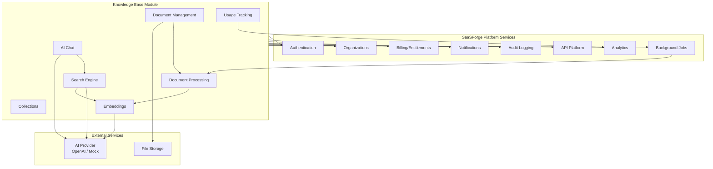
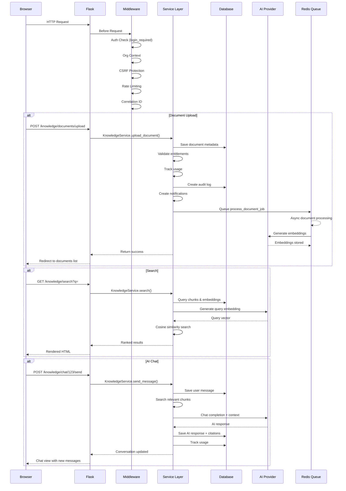
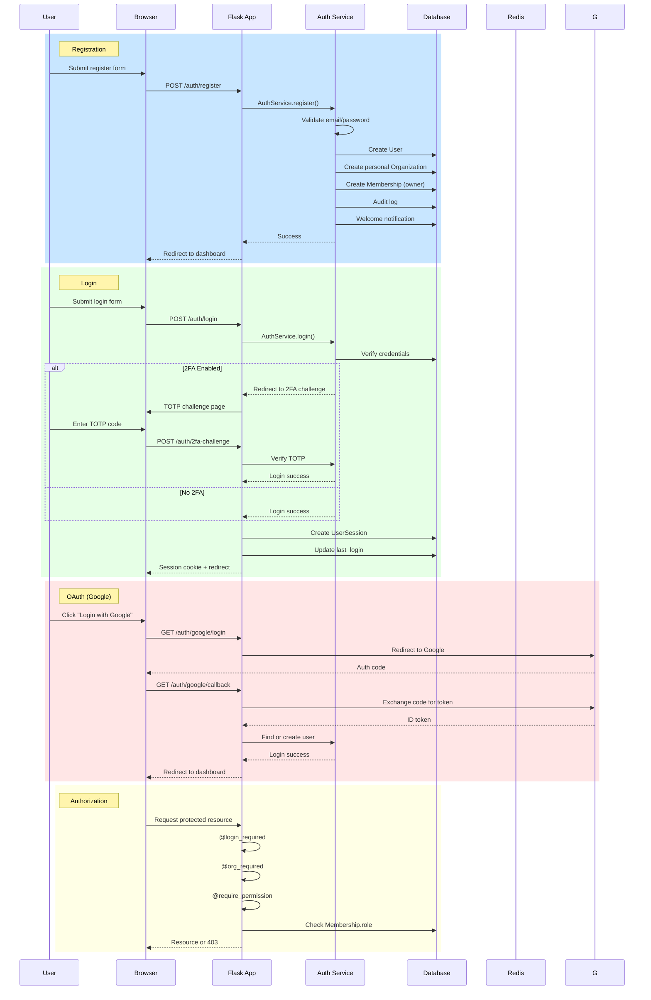
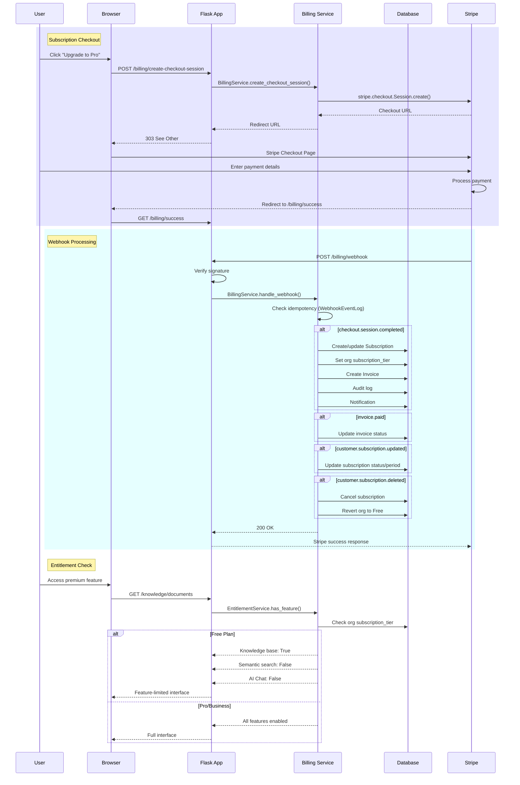

# SaaSForge Product Architecture

## Overview

SaaSForge is a production-ready multi-tenant SaaS platform that powers custom applications. This document describes both the platform architecture and the Knowledge Base product built on top of it.

---

## Diagram 1: SaaSForge Platform Architecture

```mermaid
graph TB
    subgraph Users["Users & Authentication"]
        U[User] --> REG[Registration]
        U --> LOG[Login]
        U --> OAU[OAuth]
        U --> _2FA[2FA TOTP]
        REG --> AUTH[Auth Service]
        LOG --> AUTH
        OAU --> AUTH
        _2FA --> AUTH
    end

    subgraph Organizations["Multi-Tenant"]
        AUTH --> ORG[Organization Service]
        ORG --> MEM[Membership/RBAC]
        ORG --> INV[Invitations]
        MEM --> ROL[Role Service]
        ROL --> PERM[Permissions]
    end

    subgraph Billing["Billing & Monetization"]
        SUB[Subscription] --> STR[Stripe Checkout]
        SUB --> POR[Customer Portal]
        STR --> WEB[Stripe Webhook]
        WEB --> ENT[Entitlement Service]
        WEB --> INV
    end

    subgraph Platform["Platform Services"]
        API[API Platform] --> KEY[API Keys]
        API --> SCOPE[Scoped Permissions]
        API --> RATE[Usage Limits]
        
        NOT[Notification Service]
        AUD[Audit Service]
        ANA[Analytics Service]
        CACHE[Cache Service]
        JOB[Background Jobs/RQ]
        
        WEBHOOK[Webhook Service]
        DEMO[Demo Environment]
        IMP[Impersonation Service]
    end

    subgraph Storage["Data Layer"]
        DB[(PostgreSQL)]
        REDIS[(Redis)]
        FS[File Storage]
    end

    ORG --> DB
    Billing --> DB
    Platform --> DB
    Platform --> REDIS
    Platform --> FS
    AUTH --> DB
```

---

## Diagram 2: Knowledge Base Product Architecture

---

## Diagram 3: Request Lifecycle

---

## Diagram 4: Authentication Flow

---

## Diagram 5: Billing Flow

